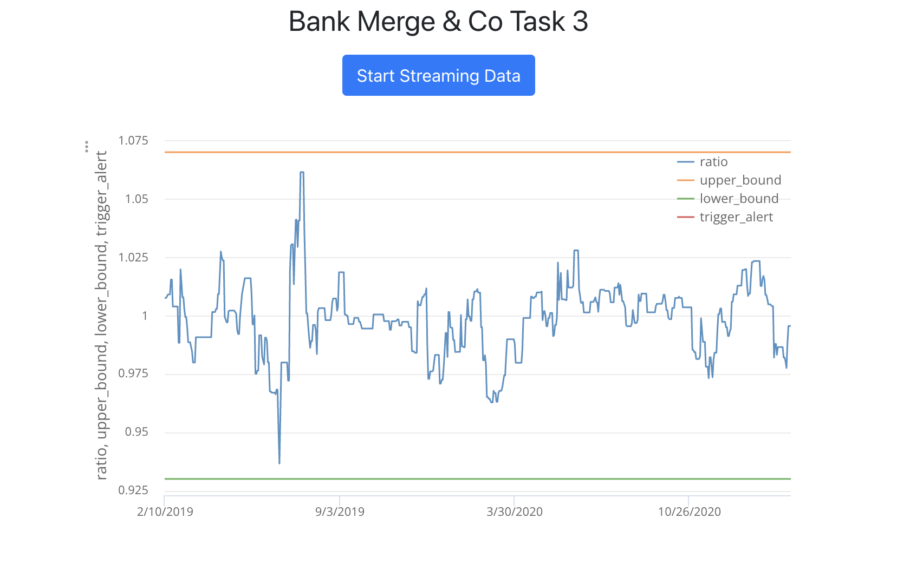

# Welcome to the J.P. Morgan Software Engineering Virtual Experience !
### All 3 Tasks are complted 
Tasks are available in individual module with a .patch extension
 
### Prerequisite : Node & npm & python3 must be installed
After downloading -> Shoot a terminal and use command: npm install & python3 datafeed/server3.py & npm start 
 
# Troubleshooting: 
If npm install still causes errors out for you, try downloading the node_modules by the Link given below :
https://drive.google.com/file/d/1amF7C-4mRZCi3Ab5xuH0XCRQubp4aa_t/view
 
### If all goes well (and it should), you should end up with a similar result given below 

